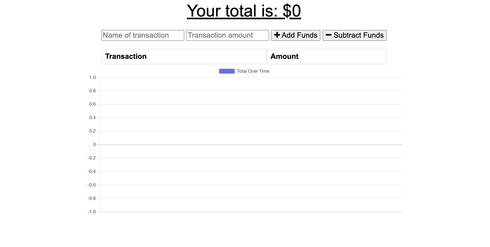
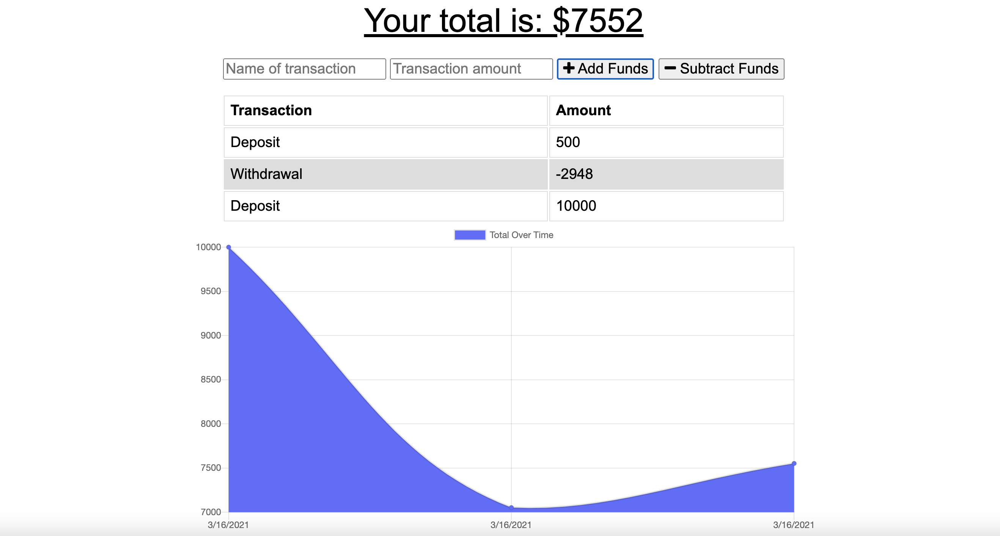

# Budget Tracker

## The purpose:

To enable users to add expenses and deposits to their budget with or without a connection. When entering transactions offline, they should populate the total when brought back online

## Features:

This application has the following features:

1. Allows users to enter their deposits/expenses online
2. Allows users to enter their deposits/expenses offline or without internet, and when they are online entries will be saved in a database

## Screenshots:

The following pictures show the web application's appearance and functionality:

## Live URL of the deployed application:

[Click here](https://budget-tracker-faisal.herokuapp.com/)
